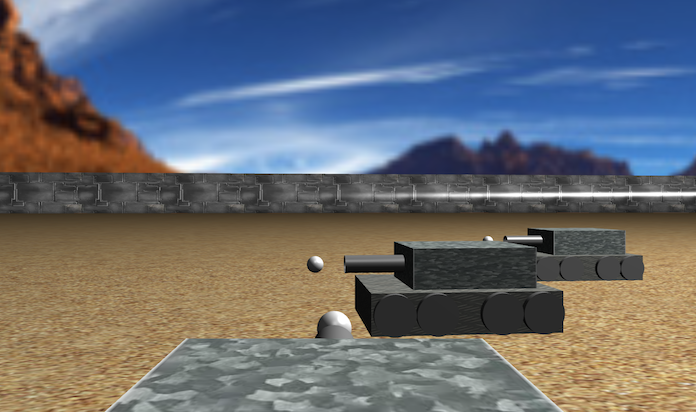

# bbtank3d

3D multiplayer battle tank using babylon.js



## Getting Started

Just run the index.html file. 

### Prerequisites

What things you need to install the software and how to install them

```
npm install live-server -g
```

### Installing

A step by step series of examples that tell you how to get a development env running

In project folder, run:

```
live-server
```


End with an example of getting some data out of the system or using it for a little demo

## Server

Checkout the server code in:

[https://github.com/devilkazuya99/bbtank3dserver](https://github.com/devilkazuya99/bbtank3dserver)

## Running the tests

Explain how to run the automated tests for this system

### Break down into end to end tests

Explain what these tests test and why

```
Give an example
```

### And coding style tests

Explain what these tests test and why

```
Give an example
```

## TODOs
- [x] tank navigation with keyboard
- [x] tank cannon turning with keyboard
- [x] attach camera to tank
- [ ] bullet and collision
- [ ] Tank HP sprite
- [ ] Multiplayer mode

## Deployment

Add additional notes about how to deploy this on a live system

## Built With

* [babylon.JS](https://www.babylonjs.com/) - A complete JavaScript framework for building 3D games and experiences with HTML5, WebGL, WebVR and Web Audio

## Contributing

Please read [CONTRIBUTING.md](https://gist.github.com/PurpleBooth/b24679402957c63ec426) for details on our code of conduct, and the process for submitting pull requests to us.

## Versioning

We use [SemVer](http://semver.org/) for versioning. For the versions available, see the [tags on this repository](https://github.com/your/project/tags). 

## Authors

* **devilkazuya99** - *Initial work* - [bbtank3d](https://github.com/bbtank3dh)

See also the list of [contributors](https://github.com/your/project/contributors) who participated in this project.

## License

This project is licensed under the MIT License - see the [LICENSE.md](LICENSE.md) file for details

## Acknowledgments

* Hat tip to anyone whose code was used
* Inspiration
* etc